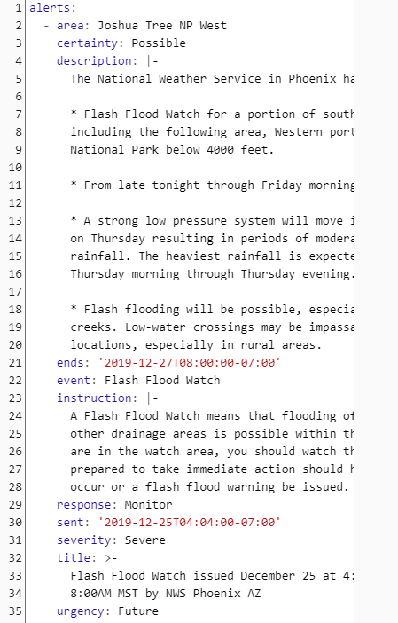

# custom_component to get info from alerts.weather.gov

A platform which allows you to get information from alerts.weather.gov.


# Breaking change

No breaking changes (unless you manually installed pull request updates or are updating from a version dated prior to December 25, 2019 - read the documentation below for potential configuration changes). 


# Installation

It is recommended to install weatheralerts via HACS. To install manually, put all the files from `/custom_components/weatheralerts/` here:
`<config directory>/custom_components/weatheralerts/`

Once installed (via HACS or manually), continue reading below to configure the weatheralerts sensor platform.


# Configuration

To find your zone ID number, go to [https://www.weather.gov/pimar/PubZone](https://www.weather.gov/pimar/PubZone), click the PDF or JPG for your state, and then find your Zone number on the map.

To find your county ID number, go to [https://alerts.weather.gov/](https://alerts.weather.gov/), scroll down the page to find your state, click the County List link next to your state, lookup the six character county code for your county in the table, and then take just the number from that county code to use as your county ID number. For example, Outagamie County in Wisconsin has county code WIC087. The county ID number to use in the platform configuration would be 87.

You can also use [https://alerts.weather.gov/](https://alerts.weather.gov/) to get marine zone IDs and configure another weatheralerts platform to monitor weather alerts for marine zones. Use the same general procedure as mentioned above for county ID, but here you will find your primary marine zone name at the bottom of the list of states, and then you click the Zone List link next to your marine zone to find the specific marine zone ID for your desired location.

**Example configuration.yaml:**

```yaml
sensor:
  platform: weatheralerts
  state: WI
  zone: 38
  county: 87
  
```

**If your zone or county ID number starts with one or more 0's you need to wrap quotes around it, or just skip the leading 0's (so `010` should be `"010"` or `10`, and `003` should be `"003"` or `3`)**

**Configuration variables:**

| key | description |
| :--- | :--- |
| **platform (Required)** | The platform name. |
| **state (Required)** | Two letter code for your state ex.("CA" for California). |
| **zone (Required)** |  One, two, or three digit code of the zone you want to monitor ex. 38 |
| **county (Optional)** | One, two, or three digit code of the zone you want to monitor ex. 87 |
| **scan_interval (Optional)** | Number of seconds between updates. Default is 30 seconds if option is not specified. |

### **It is highly recommended to use BOTH zone and county IDs in the platform configuration to increase the reliability of alerts. If you only use the 'zone' config option, you may not get all of the active alerts for your location.**


## Sample overview


## Attributes



When there are alerts, the information about them are stored in a list in the attributes.
The content of that list can be used in automation templates, template sensors and a good amount of custom Lovelace cards.


## YAML and Lovelace
Sample yaml packages are included in the repository packages directory [https://github.com/custom-components/weatheralerts/packages/](https://github.com/custom-components/weatheralerts/packages/). See [Home Assistant Packages](https://www.home-assistant.io/docs/configuration/packages/) for more info on how to use yaml packages. The yaml packages currently available:
* **weatheralerts.yaml** - includes the main weatheralerts sensor platform configuration. If you already have the weatheralerts platform configured elsewhere, you won't need this.
* **weatheralerts_1.yaml** - rename your first weatheralerts platform sensor entity ID to `sensor.weatheralerts_1` to use this yaml package which includes template sensors for up to 5 active alerts and a script and automations to handle UI notifications.
* **weatheralerts_2.yaml** - rename your second weatheralerts platform sensor entity ID to `sensor.weatheralerts_2` to use this yaml package which includes template sensors for up to 5 active alerts and a script and automations to handle UI notifications.

The yaml packages have some documentation included in them. Additional yaml package documentation and lovelace examples will be added here in the near future.


# Todo list
* Add more documentation
* Add config flow to allow UI-based configuration (eliminate yaml-based platform configuration)
